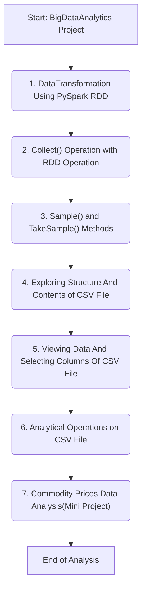

# Report: Big Data Analytics Project Workflow

## 1. Project Overview

This report details the structure of the **`BigDataAnalytics`** project hosted on GitHub. The project appears to be a series of data analysis tasks implemented entirely in **Jupyter Notebook**. The repository contains a sequence of commits or files that suggest a structured workflow for processing and analyzing data, likely using PySpark for big data operations.

### Repository Details:
*   **Name**: BigDataAnalytics
*   **Language**: Jupyter Notebook (100.0%)
*   **Description**: No description, website, or topics were provided for the repository.
*   **Activity**: The repository has 0 stars, 0 watchers, and 0 forks.
*   **Releases/Packages**: No releases or packages have been published.

## 2. Inferred Analysis Workflow

The project's structure is laid out in a series of numbered steps, from initial data transformation to a final mini-project. This suggests a pedagogical or step-by-step approach to learning and applying data analysis techniques.

1.  **Data Transformation Using PySpark RDD**: The process begins with data transformation, specifically using PySpark's Resilient Distributed Datasets (RDDs). This is a fundamental step in big data processing for cleaning, structuring, and preparing data for analysis.
2.  **`Collect()` Operation with RDD**: This step likely involves retrieving data from the distributed RDDs and bringing it back to the driver node. The `collect()` operation is used to view the results of transformations.
3.  **`Sample()` and `TakeSample()` Methods**: Following data collection, the workflow includes sampling. These methods are used to select a random subset of the data, which is useful for testing, exploration, and reducing dataset size for preliminary analysis.
4.  **Exploring Structure and Contents of a CSV File**: The focus then shifts to a specific file format, CSV. This stage involves initial exploratory data analysis (EDA) to understand the dataset's schema, data types, and basic statistics.
5.  **Viewing Data and Selecting Columns of a CSV File**: This is a data manipulation step where specific columns of interest are selected from the CSV file. This is crucial for narrowing down the analysis to relevant features.
6.  **Analytical Operations on a CSV File**: The workflow proceeds to perform analytical operations. This could include aggregations, filtering, sorting, and other calculations to derive insights from the CSV data.
7.  **Commodity Prices Data Analysis (Mini Project)**: The process culminates in a mini-project. This step likely applies all the previously mentioned techniques to a specific dataset about office employees to solve a practical problem or answer analytical questions.

## 3. Workflow Flowchart

The following flowchart visualizes the sequential process inferred from the repository's file structure.

***
